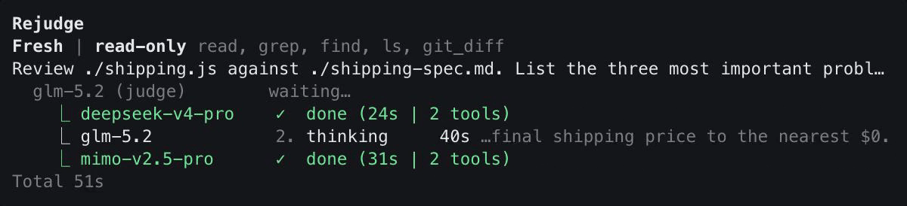

# Rejudge

**Two heads are better than one. Several models and a judge dig deeper. Independent second opinion for your agent.**



One npm package gives you three ways to run it: the `rejudge` command, a native Pi tool, and an Agent Skill for coding agents outside Pi. More at [rejudge.syabro.com](https://rejudge.syabro.com).

## Why several models

There are four ways to check code an agent wrote. Each one catches more than the last.

**I. Same session, same model.** The agent rereads its own code. It already decided this code is correct, and reading it again does not change that decision.

**II. New session, same model.** The context is clean, the model is not. It has the same training and the same habits, so it accepts the mistakes it would have written itself.

**III. A different model, its own session.** A different model does find real bugs. But you now have two opinions, and when they disagree, you are the one who decides which is right.

**IV. Rejudge: three models and a judge.** All three models get the same question at once. Each one works in an isolated context and makes its own tool calls, so none of them sees what the others do. The judge reads all three reports, asks follow-up questions where they disagree, and writes one answer. When all three report the same problem, three independent checks agree on it. When they split, the judge resolves it instead of you.

## Quick start

### 1. Install

```bash
npm install -g rejudge
```

Using a coding agent other than Pi? Install the Agent Skills so it can call Rejudge, through the [Skills CLI](https://www.skills.sh/docs/cli). Pi is not required on this path.

```bash
npx skills add syabro/rejudge -g -y
```

The skills are a separate copy, so update them after each Rejudge release with `npx skills update -g -y`.

### 2. Using Pi? Add the extension

```bash
pi install "$(npm root -g)/rejudge"
```

Inside Pi you watch the run live and see which model is at which stage. Agents get more control over the tool than over the CLI.

Pi records the path instead of copying it, so the command, the native `rejudge` tool, and both workflows come from one installation. Restart Pi if it was already running.

### 3. Connect a provider

Already using Pi? Nothing to do here. Rejudge takes the providers you set up in Pi.

Rejudge runs on Pi and reads Pi's provider settings, so any key Pi accepts works here: `ANTHROPIC_API_KEY`, `OPENAI_API_KEY`, `GEMINI_API_KEY`, `OPENROUTER_API_KEY`, `OPENCODE_API_KEY`, and more — the full list is in the [Pi docs](https://pi.dev/docs/latest/providers#api-keys).

I personally use [OpenCode Go](https://opencode.ai/go?ref=GSCMBMGRST) (referral link: $5 for you, $5 for me) because it offers an excellent mix of models for $10 a month.

For [subscription](https://pi.dev/docs/latest/providers#subscriptions) logins Rejudge still goes through Pi. If Pi is not authorized yet, run `npx -y @earendil-works/pi-coding-agent`, then `/login` inside Pi.

### 4. Pick your models

Create `~/.config/rejudge/config.json` once.

```json
{
  "reviewers": [
    "opencode-go/deepseek-v4-pro@high",
    "opencode-go/mimo-v2.5-pro@high",
    "opencode-go/minimax-m3@high"
  ],
  "judge": "opencode-go/glm-5.1@high"
}
```

Two reviewers minimum. Every model needs a reasoning level, and a higher level means a longer and more thorough review: `minimal`, `low`, `medium`, `high`, `xhigh`.

A `.rejudge/config.json` in the current project wins over the global file, and `$XDG_CONFIG_HOME/rejudge/config.json` works in place of `~/.config`.

### 5. Ask

```bash
rejudge "does this migration need a lock?"
git diff | rejudge "review this change"
rejudge --resume <run-id> "what about the rollback path?"
```

The answer goes to stdout; progress, config, and the run ID go to stderr, so redirecting stdout to a file leaves you the answer and nothing else. A terminal shows both streams together.

Prompts can also come from a file or a heredoc:

```bash
rejudge -f prompt.txt
rejudge <<'EOF'
Review this project and identify the two most important risks.
EOF
```

With a positional instruction and piped stdin, Rejudge sends both as one request: the instruction first, a blank line, then the piped payload. Without a terminal this form waits for stdin to reach EOF, and empty piped stdin leaves the positional prompt unchanged.

Inside Pi the same package registers a native `rejudge` tool plus the `/rejudge` and `/rejudge-diff` workflows.

## How it works

Reviewers get read-only tools: `read`, `grep`, `find`, `ls`, `git_diff`, and `web_search` if the host provides one. By default they cannot edit files or run shell commands. The judge gets no access to your workspace at all: it sees the three reports and can ask the reviewers more questions through `ask_panel`, nothing else. The Pi tool never widens any of this.

Every run ends with a run ID. `rejudge --resume <run-id> "..."` reopens the same sessions with a new question. The first new turn goes only to the judge, and the reviewers hear it only if the judge calls `ask_panel`.

`rejudge --unsafe "..."` — also spelled `--full` — gives every reviewer `edit`, `write`, and `bash` in your environment. This is not a sandbox. The judge still gets only `ask_panel`. Use it only when you mean for a reviewer to change files and run commands.

## What it sends and what it costs

**Every model you configure sees your request.** A fresh review sends it to each reviewer. Reviewers read files and diffs through their tools, and anything they read becomes part of that model session. The judge does not read your workspace, but the reviewer write-ups it receives may quote your request or your code. Treat what you send as shared with every provider on your list. The same goes for `web_search`: the query reaches whatever service the host has wired up.

**Text can steer a reviewer.** Instructions inside your request, or inside a file a reviewer opens, can push it into reading or reporting other things its tools can reach. Read-only access stops local changes; it does not keep file contents private.

**One fresh review is one call per reviewer plus one for the judge.** Tool loops, provider retries, one empty-output recovery attempt, and `ask_panel` follow-ups add more on top. Rejudge has no spending cap — the bill and the rate limits come from the models you picked, so read their terms before running a large panel at high reasoning levels.

**Sessions are written to disk while a run executes.** They land in `${TMPDIR}/rejudge/runs/<run-id>/` and hold the request, the model messages, and the tool calls and results. Failed and cancelled runs leave their files behind, and only a successful run with a manifest can be resumed. A directory becomes eligible for cleanup after roughly 24 hours, and only a later fresh review triggers that check, so deletion is best-effort. Your operating system's temp cleanup is a separate matter.

**`debugLog` is off by default.** Turn it on and Rejudge writes `.rejudge/logs/*.jsonl` with full model thinking and assistant text plus truncated tool arguments and results. Keep both locations out of version control and delete records on whatever schedule you already use.

**A finished run is not a correct run.** Success means the reviewers and the judge completed, nothing more. The reviews start in separate sessions, but their errors can still line up. Rejudge does not promise correctness, does not treat agreement as truth, and has no measured advantage over one strong model. Verify anything consequential.

## Requirements

- Node.js 22.19.0 or newer.
- npm.
- An API key or Pi login for every provider you configure.
- Pi, for the native tool and the workflows.

The npm package ships prebuilt CLI and extension files, so running Rejudge needs no Bun. Building from source does.

Release checks run the packed artifact in Node 22.19.0 Docker containers. Development is tested with Node 24.14.0, npm 11.14.1, Bun 1.3.13, and Pi 0.83.0.

## Install from source

Needs Git, Node, npm, Bun, and [just](https://just.systems/).

```bash
git clone https://github.com/syabro/rejudge.git
cd rejudge
just setup
npm link
pi install "$PWD"
```

`npm link` puts this checkout's CLI on your `PATH`, so later `just build` runs update it, and `pi install` registers the same checkout. Rebuild after changing `src/`. Run `just` on its own to list the repository workflows.

## When something breaks

- **Unsupported Node version** — install Node 22.19.0 or newer, then reinstall Rejudge.
- **`rejudge: command not found`** — check that `npm install -g rejudge` succeeded and that the `bin` directory under `npm prefix -g` is on your `PATH`.
- **`rejudge: no config found`** — create `.rejudge/config.json` in the project, or the global file shown above.
- **Authentication failure** — export the provider key in the same shell that starts `rejudge` or Pi. The last stderr line names the stage that failed and usually contains `API key`, `authentication`, `credentials`, or `unauthorized`.
- **Pi does not show Rejudge** — run `pi list`, check that the registered path matches `$(npm root -g)/rejudge`, then restart Pi.
- **A model or a stage fails** — read the final stderr reason, then check the model ID, provider access, rate limits, and network.
